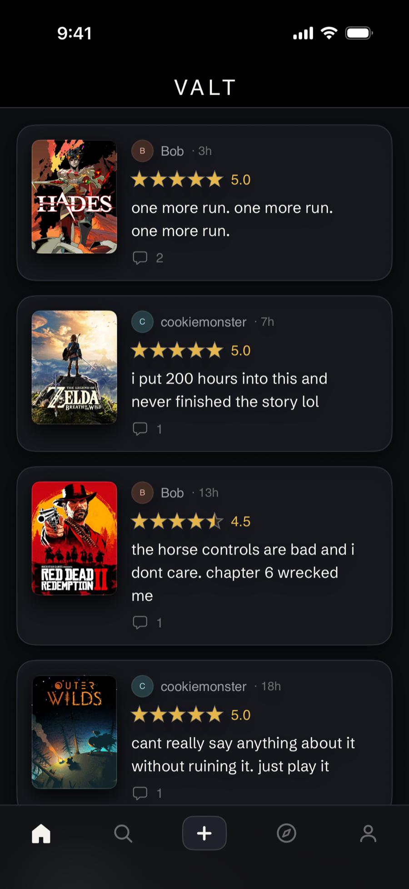
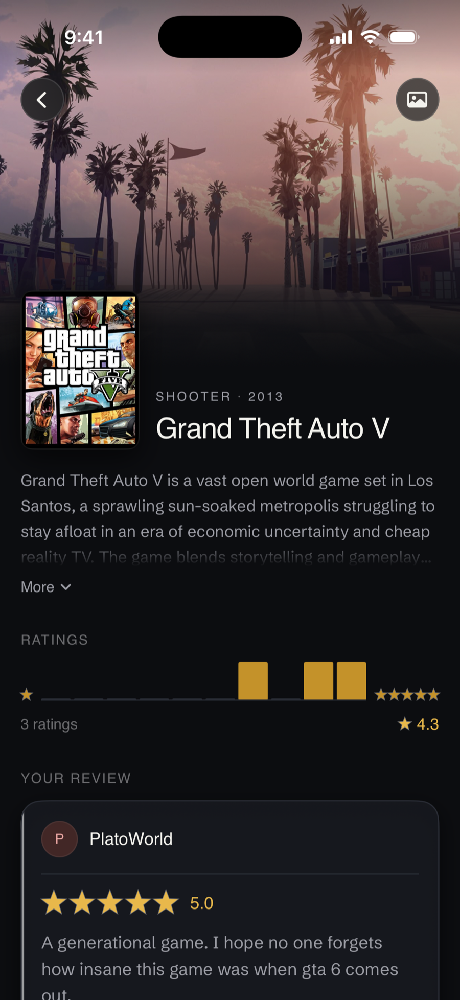
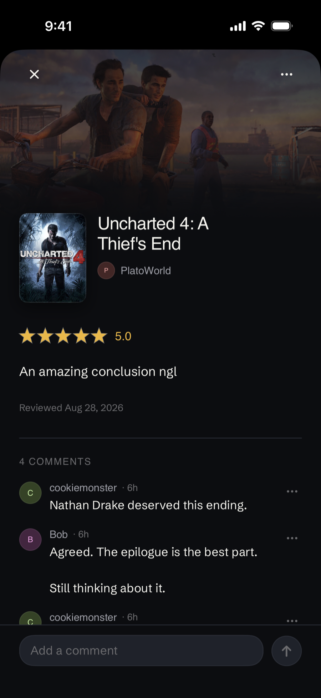
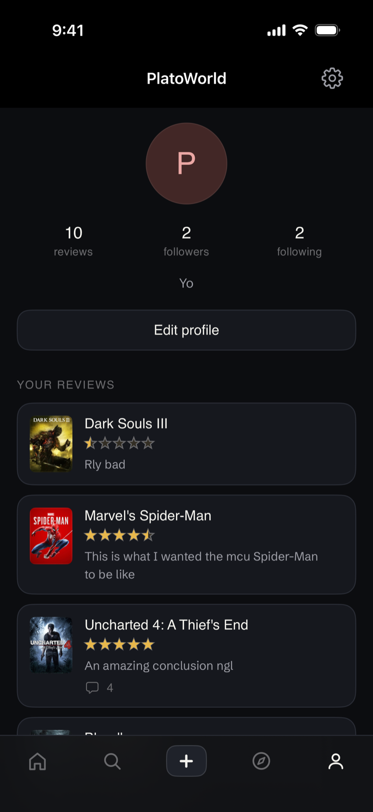

# Valt

Valt is Letterboxd for video games: log what you have played, rate and review it,
follow people, and read what they thought. A native iOS app on a TypeScript
backend, built solo.

The loop runs end to end on a physical device against a real backend and a live
IGDB integration. It is not hosted, so it runs against a laptop over LAN.

**The source is private and available on request.** This repo is the write up:
what was built, how the decisions were measured, and what is not finished.

https://github.com/user-attachments/assets/cdea8a0c-c4fd-4995-8df8-9c62eb0ed926

## What works

Sign in, search a game, rate and review it, follow someone, see their review in
your feed, open it, comment on it.

- **Auth** with email and password: argon2id, JWT via jose, `requireAuth` and
  `optionalAuth`. Sign in with Apple is intended, not built.
- **IGDB game data** proxied and cached in Postgres. The client never talks to
  IGDB and never holds the key.
- **Reviews** with half star ratings, 0.5 to 5, and optional text. Edited and
  deleted from the view they are read in.
- **A rating histogram** per game, public, so it renders before you sign up.
- **Follows, profiles and people search** that answers whether you already follow
  each result in the statement that finds them.
- **A feed** of the people you follow, cursor paged and cached to disk, so it
  draws on launch and refreshes behind.
- **Comments** on any review, deletable by their author and by the review's
  author.
- **A paid tier** unlocking per review backdrop art, resolved at read time so a
  lapsed subscription hides a choice rather than destroying it.

| Feed | Game page | Review and comments | Profile |
|---|---|---|---|
|  |  |  |  |

## Stack

**Server** TypeScript, Express 5, Prisma, Postgres on RDS. Five runtime
dependencies.

**iOS** Swift and SwiftUI, deployment target 26.5, `@Observable` screen models,
async/await over URLSession. No third party dependencies at all: the image
pipeline, the disk caches and the Keychain wrapper are hand written.

**Layout** A monorepo, one backend and one iOS client. `shared/` was meant to
hold the API contract and is empty, see below.

## How decisions were made

### Latency was round trip count, not slow code

The laptop is in California and the database is in Virginia, so **every SQL
statement costs about 82 ms**, and an endpoint's latency is that times its number
of statements. Application code never exceeded **5 ms** on any endpoint
measured.

Search was the worst of them at **2,034 ms** for twenty results, of which IGDB
was 190 ms and the rest was twenty cache writes with the client blocked. It now
answers from the IGDB payload and caches afterwards: **2,034 ms to about
146 ms**, and latency stopped scaling with result count, which had tracked
linearly at 89 ms each. The `.catch` on that detached write is load bearing,
because Node terminates the process on an unhandled rejection. Tested by pointing
the database at a dead port.

### A pagination bug that only appeared if you edited mid scroll

Ordering the feed on `updatedAt` looked fine and was measurably wrong. Prisma
re-reads the cursor row's timestamp by subselect at query time, so editing **the
cursor row itself** between pages moved it to now and the predicate collapsed to
"everything at or below now": the whole feed served again, duplicating everything
already scrolled past. Observed as **4 items returned where 3 were correct**.

`createdAt` is immutable here, and with `id` as the tiebreak the pair is a total
order. Verified against a deliberate three way tie.

### The image optimisation that measured worse

`AsyncImage` has no decoded image cache, so covers decoded again on every scroll
back into view, at full size regardless of display size. The replacement
downsamples at decode, off the main thread.

The part worth reading is the experiment that was reverted. Requesting a smaller
IGDB variant for small rows is obviously correct, and it shipped, and it came
back out after looking visibly softer. Downsampling to the same output size from
the **larger** source keeps **23% more high frequency detail** on a feed card and
**14% even on a 44 pt row**: a **1.05x** downscale softens edges while averaging
almost nothing, where a 2.1x reduction averages about four source pixels into
each output pixel. Fetch meaningfully larger than the target, then downsample.

### A picker that was measured and then not built

IGDB shipped multiple covers per game, which sounds like a picker. Measured
first: **3.3%** of the cached catalogue has more than one cover, and the **median
is 1 in every sample taken**, so the control would not have rendered on **96.7%**
of the catalogue. Not built.

The same pass found a live defect in the backdrop picker that *did* ship. Its
filter judged images on shape alone, so a 1280x720 logo plate passed as landscape
art, and three of the four that slipped through were a game's default hero. Fixed
with an exclude list rather than an include list, so the image types IGDB adds
later stay usable instead of silently shrinking every picker.

### A control that lies is worse than no control

An activity bell, a "Now playing" shelf, two review sections on the game page and
a backdrop picker in Edit Profile were all deleted under that rule. "Now playing"
is the clearest: `playStatus` is only ever `COMPLETED` in practice, so that list
would have been permanently empty for every user.

Where the answer has merely not arrived yet, the corollary is to draw nothing
rather than guess. The follow button waits as a shape with no tap target, sized
so nothing moves when the real one lands, because a button that renders a state
and then flips it invites a tap against a fabricated baseline. Two of the deleted
things came back later, once there was real data behind them.

### Fixing a bug is not the same as proving it fixed

Adding comment counts surfaced an older bug. The feed decided "nothing changed"
by comparing review **ids**, and an id does not move when someone edits their
text or a count changes, so every one of those refreshes arrived, matched, and
was silently discarded.

The fix is a value comparison, then proved by A/B on the simulator: same cache,
same server, same everything else, the old comparison renders no count at all and
the new one renders 6.

## What is not built

- **Not hosted.** The server runs on a laptop; the client points at localhost on
  the simulator and a hardcoded LAN address on device.
- **No payments.** The paid tier is a boolean with a development only route to
  flip it. No entitlement check, and written up as a privilege escalation hole to
  remove before any payment path exists.
- **No automated tests.** Verification was query logs, `EXPLAIN`, curl permission
  matrices and checks on device.
- **No rate limiting on comments.** The only limiters cover register and login,
  for argon2's CPU cost rather than spam.
- **Comments cannot be edited**, only deleted; the row has no `updatedAt`.
  Reviews can be edited and deleted.
- **Six screens compile and nothing pushes them:** Browse, Followers, Wrap,
  ListsHub, Library, and a mock friend profile.
- **`shared/` is empty.** The API contract lives in the server's types, mirrored
  by hand in Swift.

## What I would do next

- Host the server, so it stops being a laptop on a LAN.
- Add `publishedAt` to `Review`. A bare log that later gains a rating keeps its
  original `createdAt`, so it sorts back dated below every follower's cursor and
  is invisible.
- Measure Prisma's `relationJoins`. Every `include` is its own round trip today,
  so the feed's is three statements where it reads like one.
- Delete the development tier toggle and rate limit comments before anything is
  public.
- Tests around the two things verified by hand and easiest to regress: cursor
  pagination and the comment permission matrix.
- Decide the six unreachable screens: wire them to real data, or delete them.

